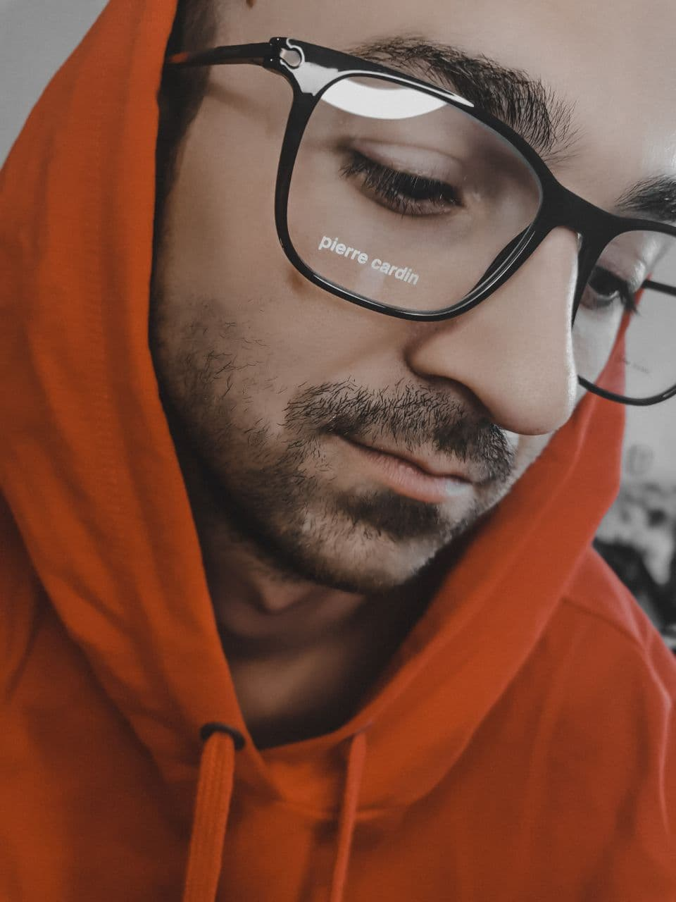

Ruslan Eloyan
====================


---

**Contacts**
-------------------------

*   **Adress:** Minsk, Belarus
*   **Phone:** +375 44 568-44-70
*   **Email:** eloyan666@gmail.com
*   **GitHub:** [ELruslan](https://github.com/elruslan)
----
**About Me**
-------------------------

I am electronics engineer with 7+ years of experience electrical repair shops. In 2016 the created service center "Elservice" and has worked more than 5 years and this year decided career change.
I recently began to be fascinated by web programming, e.g. developing apps and building websites.
Well, I'm on a course at the moment in RS School.I would like to get a position of junior front-end to use my learnig skills  for create websites and developing apps.
My personal qualities: ambitious, collaborative,communicative,positive.

---

**Skills**
---------------------

*   HTML
*   CSS
*   JavaScript (Basic)
*   Git
*   Figma
----
**Work**
---------------------

*   Electrical repair shops "Elservice" 2016-2021 year
*   Electrical repair shops "Greenservice" 2013-20215 year
*   Manufacturing equipment and electronic means software testing departments "Horizont" 2012 year
----
**Code Example**
---------------------------------

    
```javascript
function getMatrix(number) {
                        // good luck
                        let arr=[];
                          for(let i = 0; i < number; i++){
                            arr[i]=[];
                            for(let j = 0; j < number; j++){
                              arr[i].push(0);
                          }
                            arr[i][i] = 1;
                          
                        }
                        return arr;
                      } 
}
```
                      
----   


*   **Education:** Polotsk State University , Faculty of Computer Science
and Electronics,engineer, electronics engineer, programmer
*   **Courses:**
    *   Lider 
    *   RS school
-----
**English**
-----------------------

**A2** (I am learning english now)
